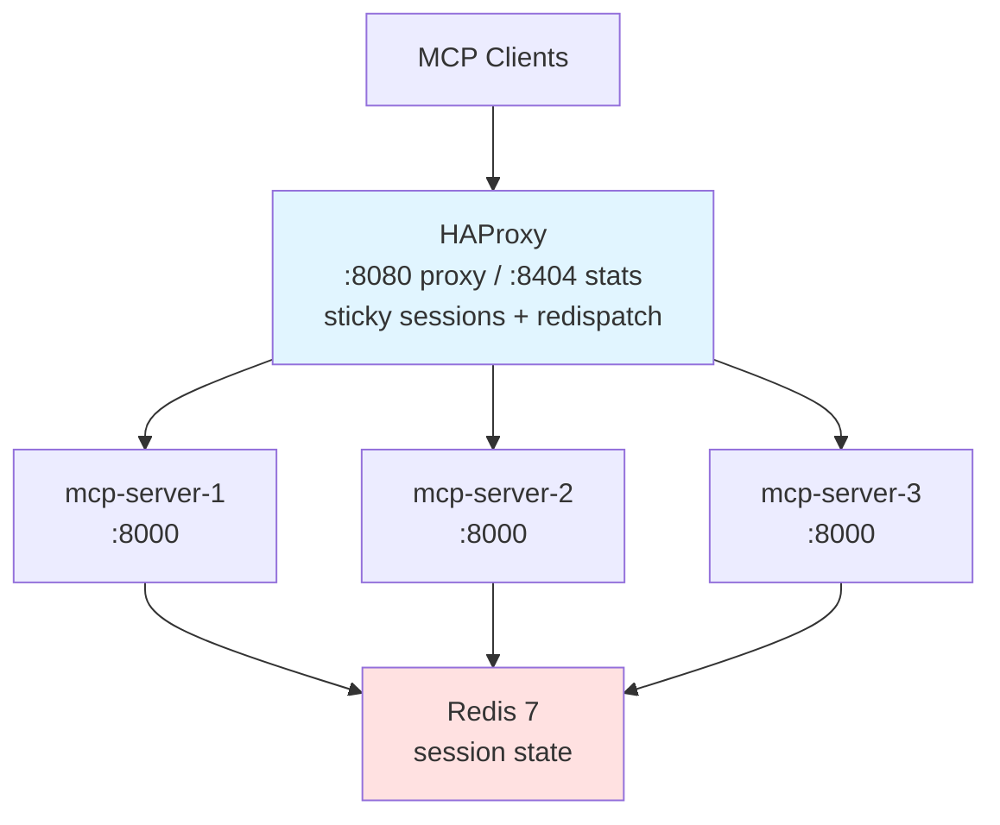
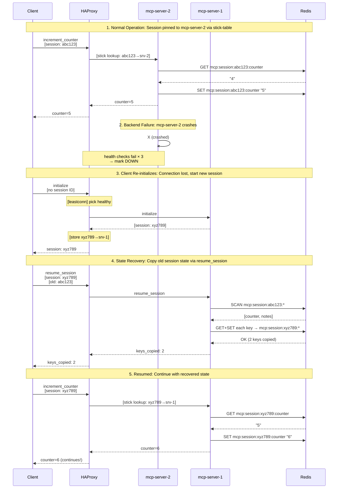

# High Availability for Stateful MCP Servers

MCP (Model Context Protocol) servers are inherently stateful -- each client-server session maintains state tied to a `mcp-session-id` header. This project demonstrates how to use **HAProxy's stick-table** feature to provide session-affine routing for MCP's Streamable HTTP transport, with **Redis-backed session state** for durability across server restarts and failovers.

## Architecture



- **3 MCP server instances** running a stateful FastMCP server (session-scoped counters and notes)
- **Redis** for externalized session state -- survives server restarts and enables failover
- **HAProxy** in front, using a stick-table to map `mcp-session-id` headers to backends, with `option redispatch` for failover when a backend is down
- All orchestrated via **Docker Compose**

## Failure Recovery Flow

When a backend crashes or is stopped, the system recovers gracefully thanks to externalized state in Redis:



**Key recovery steps:**

1. **Normal operation**: Stick-table routes `abc123` → `mcp-server-2`, state in Redis
2. **Failure detected**: Health checks fail (3 × 5s), HAProxy marks `mcp-server-2` as DOWN
3. **Redispatch**: Client re-initializes, `leastconn` picks healthy `mcp-server-1`, new session `xyz789`
4. **State recovery**: `resume_session(abc123)` copies all Redis keys from old to new session
5. **Continuation**: Counter increments 5→6, application continues seamlessly

**Key points:**
- `option redispatch` prevents 503 errors, automatically reroutes to healthy backends
- Old session state persists in Redis (30-minute TTL)
- `resume_session` copies state: `abc123:* → xyz789:*`
- Zero data loss, only brief connection interruption

## How the Sticky Routing Works

The key is in `haproxy/haproxy.cfg`:

```haproxy
backend mcp_servers
    balance leastconn
    stick-table type string len 64 size 100k expire 30m

    # First request (no session ID): leastconn picks the backend with fewest active connections.
    # Learn the session ID from the response header and bind it to this backend.
    stick store-response res.hdr(mcp-session-id)

    # Subsequent requests: match session ID from request header → same backend.
    stick match req.hdr(mcp-session-id)
```

1. **First request** (`initialize`): Client has no session ID. HAProxy routes to the backend with the fewest active connections (load-aware). The backend responds with a `mcp-session-id` header. HAProxy stores the mapping: `session-id → backend`.
2. **Subsequent requests**: Client sends `mcp-session-id` in the request header. HAProxy looks it up in the stick-table and routes to the same backend.
3. **Backend failure**: With `option redispatch` enabled, HAProxy reroutes to a healthy backend instead of returning 503. Session state is preserved in Redis and can be recovered via `resume_session`.

## Prerequisites

- [Docker](https://docs.docker.com/get-docker/) and Docker Compose
- [uv](https://docs.astral.sh/uv/) (for running tests locally)
- [curl](https://curl.se/) (for manual verification)

## Quick Start

### 1. Start the Stack

```bash
docker compose up -d --build
```

This builds 3 MCP server images and starts them along with HAProxy.

### 2. Verify Containers Are Running

```bash
docker compose ps
```

You should see 5 containers: `redis`, `mcp-server-1`, `mcp-server-2`, `mcp-server-3`, and `haproxy`.

### 3. Check HAProxy Stats

Open [http://localhost:8404/stats](http://localhost:8404/stats) in your browser. You should see all 3 backends with status **UP** (green).

### 4. Check Health Endpoint

```bash
curl http://localhost:8080/health
```

Expected output (backend will vary):

```json
{"status":"ok","instance":"mcp-server-1"}
```

The health endpoint also checks Redis connectivity. If Redis is unreachable, it returns `503` with `"status":"degraded"`.

## Manual Verification with curl

### Initialize a Session

```bash
# Send initialize request and capture response headers
curl -s -D - http://localhost:8080/mcp \
  -H "Content-Type: application/json" \
  -H "Accept: application/json, text/event-stream" \
  -d '{
    "jsonrpc": "2.0",
    "id": 1,
    "method": "initialize",
    "params": {
      "protocolVersion": "2025-11-25",
      "capabilities": {},
      "clientInfo": {"name": "curl-test", "version": "1.0.0"}
    }
  }'
```

Note the `mcp-session-id` header in the response. Copy it for subsequent requests.

### Test Stickiness

Using the session ID from above, call `increment_counter` multiple times:

```bash
SESSION_ID="<paste-session-id-here>"

# First increment → counter: 1
curl -s http://localhost:8080/mcp \
  -H "Content-Type: application/json" \
  -H "Accept: application/json, text/event-stream" \
  -H "mcp-session-id: $SESSION_ID" \
  -d '{
    "jsonrpc": "2.0", "id": 2,
    "method": "tools/call",
    "params": {"name": "increment_counter", "arguments": {}}
  }'

# Second increment → counter: 2 (same instance!)
curl -s http://localhost:8080/mcp \
  -H "Content-Type: application/json" \
  -H "Accept: application/json, text/event-stream" \
  -H "mcp-session-id: $SESSION_ID" \
  -d '{
    "jsonrpc": "2.0", "id": 3,
    "method": "tools/call",
    "params": {"name": "increment_counter", "arguments": {}}
  }'
```

If stickiness works, the counter increments sequentially and the `instance` field stays the same across calls.

## Automated Tests

Three complementary test suites are provided:

### 1. Infrastructure Tests (HTTP-based)

Tests HAProxy load balancing, sticky sessions, and failover using raw HTTP calls:

```bash
uv sync
uv run python test_lb.py
```

Expected output:

```
MCP Load Balancing Tests
==================================================
Target: http://localhost:8080/mcp

HAProxy health: 200

=== Test: Sticky Sessions ===
  Session ID: d528c59430d14bd1be7f711f910926ff
  Routed to: mcp-server-3
  Counter reached 10 on mcp-server-3 - stickiness confirmed!
  PASSED

=== Test: Distribution Across Backends ===
  Sessions distributed across: {'mcp-server-2', 'mcp-server-1', 'mcp-server-3'}
  PASSED

=== Test: Session State Isolation ===
  Session state is properly isolated
  PASSED

=== Test: Health Endpoint ===
  Health OK from mcp-server-2
  PASSED

=== Test: get_status Tool ===
  Instance: mcp-server-1, uptime: 60.4s, sessions: 7
  PASSED

=== Test: resume_session Same ID ===
  Correctly returned same_session for own session ID
  PASSED

=== Test: Notes CRUD ===
  Notes after add: ['first note', 'second note', 'third note']
  PASSED

=== Test: analyze_data with Notifications ===
  Message notifications: 7
  Log levels seen: {'info', 'debug'}
  Result: items=3, score=9.0
  Session summary confirms analysis stored
  PASSED

=== Test: Session Summary Resource ===
  Summary: counter=3, notes=['hello', 'world'], instance=mcp-server-3
  PASSED

=== Test: watch_counter with Notifications ===
  Message notifications: 5
  Change detection messages: 3
  Result: 3 change(s) detected
  PASSED

=== Test: Backend Failure - State Recovery ===
  Session 381eb66a18a4... on: mcp-server-1
  State before crash: counter=3, notes=['survive-crash']
  Stopping mcp-server-1...
  New session db123608fb3b... on: mcp-server-3
  Resumed 2 keys from old session
  Counter continues: 4 (state fully recovered)
  Restarting mcp-server-1...
  PASSED

==================================================
All tests passed!
```

### What the Tests Verify

| Test | What it proves |
|------|----------------|
| **Sticky Sessions** | Counter increments 1–10 on the same backend. Session ID always routes to the same server. |
| **Distribution** | 10 independent sessions spread across at least 2 of 3 backends (leastconn distributes by active connections). |
| **Session State Isolation** | Two concurrent sessions have independent counters and notes. |
| **Health Endpoint** | `GET /health` returns 200 with `status: ok` and instance ID; also checks Redis connectivity. |
| **get_status** | Tool returns instance, uptime, active session count, and timestamp. |
| **resume_session Same ID** | Calling `resume_session` with the current session's own ID returns `{"status": "same_session"}`. |
| **Notes CRUD** | Full add/list cycle with multiple notes; verifies insertion order. |
| **analyze_data with Notifications** | SSE stream contains info- and debug-level log notifications alongside the final result; result is stored in session and readable via the resource endpoint. |
| **Session Summary Resource** | `resources/read` on `resource://session/{id}/summary` returns correct counter, notes, and instance. |
| **watch_counter with Notifications** | Concurrent counter increments (background thread) are detected by the watcher; change notifications appear in the SSE stream. |
| **Backend Failure - State Recovery** | When a sticky backend is stopped, HAProxy redispatches; `resume_session` copies Redis keys to the new session and the counter continues from where it left off. |

### 2. MCP Protocol Tests (FastMCP Client)

Tests MCP tools, notifications, and resources using the FastMCP client library:

```bash
uv run python test_mcp_client.py
```

These tests focus on:
- Tool responses and return values
- Notification streaming (progress, logs)
- Resource reading
- Session resumption logic
- Concurrent operations

**Key difference:** The FastMCP client tests verify MCP protocol functionality without testing infrastructure concerns (load balancing, sticky sessions, failover). They complement the HTTP-based tests by ensuring the MCP server implementation is correct.

### 3. Resilience Tests (Resilient Client)

Tests automatic session resumption with actual container restarts:

```bash
uv run python test_resilience.py
```

This test:
- Builds up session state (counter, notes)
- Restarts all MCP server containers
- Automatically reconnects and resumes the session
- Verifies state persisted in Redis is recovered
- Continues operations seamlessly

**Implementation:** Uses `ResilientClient` (`resilient_client.py`), a wrapper around FastMCP Client that automatically:
- Detects connection failures
- Retries with backoff
- Calls `resume_session` to restore state from Redis
- Transparently resumes operations

## Resilient Client

The server-side infrastructure (HAProxy + Redis) handles routing and state persistence, but **the client must also participate in recovery**. When a backend crashes, the MCP protocol session is lost — the client gets a connection error, not a transparent failover. Without client-side logic, the caller would need to manually re-initialize, call `resume_session`, and retry the failed operation.

`resilient_client.py` provides `ResilientClient`, a drop-in wrapper around FastMCP's `Client` that closes this gap:

```python
from resilient_client import ResilientClient

async with ResilientClient("http://localhost:8080/mcp") as client:
    result = await client.call_tool("increment_counter", {})
    notes = await client.list_resources()
    # All async methods automatically retry on failure with session resumption
```

**How it works:**
1. All async methods from the inner FastMCP `Client` (e.g. `call_tool`, `list_resources`, `read_resource`) are wrapped with retry logic via `__getattr__`
2. On failure: waits with backoff, reconnects to get a new session, calls `resume_session` to copy state from the old session in Redis
3. Retries the original call on the new connection — the caller never sees the interruption

**Without `ResilientClient`**, a backend failure requires the caller to:
1. Catch the connection error
2. Create a new `Client` and re-initialize
3. Call `resume_session(old_session_id)` to recover state
4. Retry the failed operation

This is the pattern that `test_lb.py` uses (raw HTTP with manual recovery), while `test_mcp_client.py` and `test_resilience.py` use `ResilientClient` for automatic recovery.

## Applying This to Your Own MCP Server

This reference implementation is designed to be picked apart. Below are the six patterns you need to adopt, why each matters, and exactly where to find the code.

### 1. Externalize Session State to a Shared Store

**Why:** In-process state dies with the server. Externalizing to Redis (or any networked store) lets any instance serve any session after failover — without it, a crash means total state loss.

**What to adopt:**

- **`SessionStore` ABC** (`session_store.py:8-30`) — defines the storage contract: `get`, `set`, `delete`, `keys`, `copy_session`, `ping`. Implement this interface for your own backing store.
- **`Session` wrapper** (`session_store.py:33-55`) — binds a store + session ID + TTL with automatic JSON serde. Tool authors only call `session.get(key)` / `session.set(key, value)` — no direct store imports needed.
- **`RedisSessionStore`** (`stores/redis_store.py`) — the only file that imports `redis.asyncio`. Keys follow the `mcp:session:{session_id}:{key}` pattern with sliding TTL.
- **`InMemorySessionStore`** (`stores/memory_store.py`) — dict-backed fallback with lazy TTL expiry, for local dev without Redis.
- **Store selection** (`server.py:21`) — `RedisSessionStore(url) if REDIS_URL else InMemorySessionStore()`. One env var switches between production and local dev.

### 2. Add a Health Check Endpoint

**Why:** The load balancer needs to detect when a backend is down so it can stop routing traffic to it and trigger redispatch. Without health checks, clients hit dead backends until TCP timeouts expire.

**What to adopt:**

- **`/health` endpoint** (`server.py:209-218`) — calls `store.ping()` to verify Redis connectivity. Returns `200` with `{"status": "ok"}` when healthy, `503` with `{"status": "degraded"}` when the store is unreachable.
- HAProxy polls this every 5s (`haproxy/haproxy.cfg:42-43`): `option httpchk GET /health` with `inter 5s fall 3 rise 2` on each server line.

### 3. Include Instance Identity in Tool Responses

**Why:** When debugging routing issues across multiple instances, you need to know which server handled each request. Without this, session-affinity bugs are invisible.

**What to adopt:**

- **`INSTANCE_ID`** (`server.py:16`) — `os.environ.get("INSTANCE_ID", "unknown")`
- Every tool response includes `"instance": INSTANCE_ID` (e.g., `server.py:39`, `server.py:47`, `server.py:61`). This is a debugging aid — strip it in production if you prefer.

### 4. Implement a Session Recovery Tool

**Why:** MCP session IDs are ephemeral — when a backend crashes, the protocol session is lost and the client gets a new session ID on reconnect. Without a recovery mechanism, all prior state is orphaned in the store under the old session's keys.

**What to adopt:**

- **`resume_session` tool** (`server.py:80-95`) — accepts the old session ID and copies all store keys to the new session via `session.copy_from(old_session_id)`.
- **`Session.copy_from()`** (`session_store.py:54-55`) — delegates to `store.copy_session()`.
- **`RedisSessionStore.copy_session()`** (`stores/redis_store.py:39-62`) — uses `SCAN` to find all old keys and re-`SET` them under the new session prefix with fresh TTL.

### 5. Configure Your Load Balancer for MCP's Streamable HTTP

**Why:** MCP uses SSE for streaming responses and `mcp-session-id` headers for session affinity. Default load balancer settings (short timeouts, no session stickiness) will break both.

**What to adopt from `haproxy/haproxy.cfg`:**

- **Sticky sessions** (lines 32, 36, 40): `stick-table` keyed on `mcp-session-id` + `stick store-response res.hdr(mcp-session-id)` to learn the session ID from the first response + `stick match req.hdr(mcp-session-id)` to route subsequent requests.
- **SSE-compatible timeouts** (lines 14-16): `timeout client/server 300s`, `timeout tunnel 600s`. Default timeouts (~30s) will kill long-running tool calls mid-stream.
- **Failover** (line 10): `option redispatch` — reroute to a healthy backend instead of returning 503 when the sticky backend is down.
- **Health checks** (lines 42-43, 45-47): `option httpchk GET /health` with `inter 5s fall 3 rise 2` — backends marked DOWN after 3 consecutive failures.
- **TTL alignment**: `stick-table expire 30m` must match `SESSION_TTL = 1800` in `server.py:18`, otherwise the stick-table and session state can expire out of sync.

If you use a different load balancer (Nginx, Envoy, AWS ALB), the concepts are the same: sticky sessions on a custom header, extended timeouts for SSE, health checks, and failover routing.

### 6. Use a Resilient Client

**Why:** Server-side infrastructure handles routing and state persistence, but the MCP client must participate in recovery — it needs to detect connection loss, reconnect, call `resume_session`, and retry the failed operation.

**What to adopt:**

- **`ResilientClient`** (`resilient_client.py:10-70`) — wraps FastMCP's `Client` with `__getattr__` that intercepts all async method calls.
- **On failure**: exponential backoff (`resilient_client.py:65`), reconnect + `resume_session` (`resilient_client.py:36-50`), then retry the original call.
- **Usage**: `async with ResilientClient("http://localhost:8080/mcp") as client:` — drop-in replacement for `Client`.

Without client-side resilience, every backend failure requires the caller to manually catch the error, re-initialize, call `resume_session`, and retry. See the "Resilient Client" section above for the full breakdown.

## Testing Backend Failure and Recovery Manually

```bash
# 1. Note which backend your session is on (from the curl test above)
#    and save the session ID:
OLD_SESSION_ID="$SESSION_ID"

# 2. Stop that backend:
docker compose stop mcp-server-2

# 3. Wait for HAProxy health check (fall 3 × inter 5s = ~15s)
sleep 16

# 4. Re-initialize a new session (HAProxy redispatches to a healthy backend):
curl -s -D - http://localhost:8080/mcp \
  -H "Content-Type: application/json" \
  -H "Accept: application/json, text/event-stream" \
  -d '{
    "jsonrpc": "2.0", "id": 1,
    "method": "initialize",
    "params": {
      "protocolVersion": "2025-11-25",
      "capabilities": {},
      "clientInfo": {"name": "curl-test", "version": "1.0.0"}
    }
  }'

# Copy the new mcp-session-id from the response:
NEW_SESSION_ID="<paste-new-session-id>"

# 5. Resume state from old session:
curl -s http://localhost:8080/mcp \
  -H "Content-Type: application/json" \
  -H "Accept: application/json, text/event-stream" \
  -H "mcp-session-id: $NEW_SESSION_ID" \
  -d '{"jsonrpc":"2.0","id":10,"method":"tools/call","params":{"name":"resume_session","arguments":{"old_session_id":"'"$OLD_SESSION_ID"'"}}}'

# 6. Verify counter is recovered:
curl -s http://localhost:8080/mcp \
  -H "Content-Type: application/json" \
  -H "Accept: application/json, text/event-stream" \
  -H "mcp-session-id: $NEW_SESSION_ID" \
  -d '{"jsonrpc":"2.0","id":11,"method":"tools/call","params":{"name":"get_counter","arguments":{}}}'

# 7. Restart the backend
docker compose start mcp-server-2
```

## Project Structure

```
mcp-high-availability/
├── server.py              # FastMCP server — tools, resources, health endpoint
├── session_store.py       # SessionStore ABC + Session helper (JSON serde, TTL)
├── stores/
│   ├── redis_store.py     # Redis-backed store (only file that imports redis.asyncio)
│   └── memory_store.py    # Dict-backed store with lazy TTL expiry (local dev)
├── pyproject.toml         # Python project config (fastmcp, httpx, redis)
├── .python-version        # Python 3.12
├── Dockerfile             # Server container image
├── docker-compose.yaml    # Redis + 3 MCP servers + HAProxy
├── haproxy/
│   └── haproxy.cfg        # HAProxy config with sticky sessions + redispatch
├── client.http            # Step-by-step manual testing via VS Code REST Client
├── test_lb.py             # HTTP-based infrastructure tests (HAProxy, load balancing)
├── test_mcp_client.py     # Protocol tests using resilient client
├── test_resilience.py     # Resilience test with container restarts
├── resilient_client.py    # FastMCP Client wrapper with retry + session resumption
└── README.md
```

## MCP Server Tools

The server (`server.py`) exposes these tools, all returning the `instance` field to show which backend is serving:

| Tool | Description |
|------|-------------|
| `increment_counter` | Increment a session-scoped counter (proves stickiness) |
| `get_counter` | Get current counter value |
| `add_note` | Add a note to the session's note list |
| `list_notes` | List all notes for the session |
| `get_server_info` | Return instance ID and active session count |
| `get_status` | Return instance ID, uptime, active session count, and current timestamp |
| `analyze_data` | Multi-step analysis pipeline; streams progress and log notifications via SSE |
| `watch_counter` | Poll the session counter for changes and stream log notifications on each change |
| `resume_session` | Copy state from a previous session into the current one (for recovery after crash/restart) |

The server also exposes a `resource://session/{session_id}/summary` resource that returns a JSON snapshot of the session's counter, notes, and last analysis result.

## Design Decisions

### Why `leastconn` Instead of `roundrobin` or Consistent Hashing?

**The problem:** Sessions have unequal lifetimes and request rates. Round-robin assigns sessions evenly at creation time, but over time one backend can accumulate many long-lived or high-traffic sessions while another sits idle.

**Why not consistent hashing?** Consistent hashing (`hash(session-id) → backend`) provides deterministic routing, but it's blind to actual backend load. Once a session hashes to a node, it's pinned there regardless of whether that backend is overloaded. It's designed for cache locality in stateless systems, not for load-aware routing in stateful ones.

**Why `leastconn` + stick-table?** This combines the best of both worlds:
- **Load-aware initial assignment:** New sessions go to the backend with the fewest active connections
- **Session affinity:** Stick-table pins existing sessions to their assigned backend (O(1) hash table lookup)
- **Externalized state:** Redis means any backend can serve any session after failover

The stick-table lookup (~50-100ns) is negligible compared to Redis I/O (~200-1000µs), so performance is dominated by state storage, not routing strategy.

### Key Findings

- **`stick store-response res.hdr()` works with SSE responses.** HAProxy processes HTTP response headers before the body streams, so it captures the `mcp-session-id` header even though the body is `text/event-stream`.
- **Redis externalizes session state.** All values are JSON-serialized strings stored via `SET`/`GET`. Counters are incremented in Python (read-modify-write in `server.py`), notes are stored as JSON arrays. All keys have a 30-minute sliding TTL matching the HAProxy stick-table expiry.
- **`option redispatch` enables failover.** When a sticky backend goes down, HAProxy reroutes to a healthy backend instead of returning 503. Since state is in Redis, any backend can serve any session.
- **MCP session IDs are ephemeral.** When a backend crashes, the MCP protocol session is lost and the client must re-initialize (getting a new `mcp-session-id`). The `resume_session` tool bridges old and new sessions by copying Redis keys.
- **`ctx.session_id` from FastMCP** (context.py) provides the `mcp-session-id` header value -- perfect for keying state in Redis.
- **Timeouts matter for SSE.** The `timeout client`/`timeout server` values must be high (300s) to support long-lived SSE streams. The `timeout tunnel` (600s) covers upgraded connections.

## Cleanup

```bash
docker compose down
```
